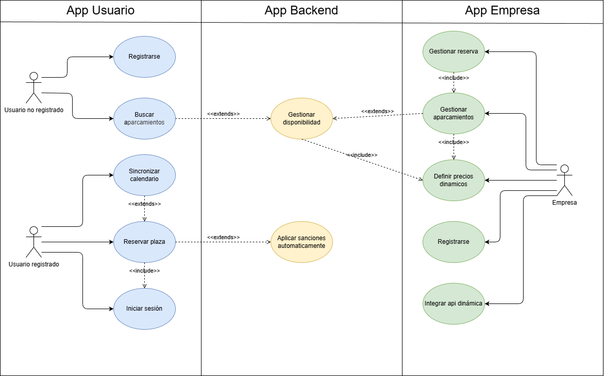

## Diagrama de casos de uso

## Especificación de Actores y Operaciones

### Actores

##### Usuario No Registrado
| Actor | Usuario No Registrado| 
|---|---| 
| Descripción | Persona que utiliza la aplicación para consultar aparcamientos sin tener una cuenta. |
| Características |Acceso limitado| 
| Relaciones | Usuario Registrado | 
| Referencias | Registrarse, buscar aparcamientos| 
| Notas | No puede reservar| 
| Autor | Nicolás Expósito Hernández | 
|Fecha | 10/02/2026|

#### Usuario Registrado
| Actor |Usuario Registrado| 
|---|---| 
| Descripción | Usuario con cuenta que puede reservar plazas de aparcamiento. |
| Características |Autenticado mediante JWT| 
| Relaciones | Usuario No Registrado | 
| Referencias | Iniciar sesión, reservar plaza, sincronizar calendario| 
| Notas | Puede sincronizar calendario | 
| Autor | Nicolás Expósito Hernández | 
|Fecha |  10/02/2026 |

#### Empresa
| Actor |Empresa| 
|---|---| 
| Descripción | Empresa propietaria de aparcamientos que gestiona plazas y precios. |
| Características |Acceso a panel de gestión| 
| Relaciones |Usuario Registrado | 
| Referencias | Registrase, gestionar aparcamientos, definir precios, gestionar reservas e integrar api| 
| Notas | Puede usar la API sin la app | 
| Autor | Nicolás Expósito Hernández | 
|Fecha |  10/02/2026 |

#### Administrador del Sistema
| Actor |Administrador| 
|---|---| 
| Descripción | Responsable del mantenimiento y control de la plataforma. |
| Características |Acceso total| 
| Relaciones |Empresa, Usuario | 
| Referencias | Aplicar sanción automática, gestionar disponibilidad| 
| Notas | Uso interno | 
| Autor | Nicolás Expósito Hernández | 
|Fecha |  10/02/2026 |

## Casos de Uso – App de Usuario
### Usuario No Registrado
#### Registrarse

|  Caso de Uso	CU.1 | Registrarse |
  |---|---|
  | Fuentes  | |
  | Actor  |  Usuario No Registrado |
  | Descripción | Crear una cuenta en NoMoreLaps  |
  | Flujo básico |Introducir datos → validar → crear cuenta |
  | Pre-condiciones | No tener cuenta |  
  | Post-condiciones  | Usuario registrado |  
  |  Requerimientos | Email y contraseña |
  |  Notas |  |
  | Autor  | nexphernandez |
  |Fecha | 10/02/2026 |

#### Buscar aparcamientos
|  Caso de Uso CU.U2 | Buscar aparcamientos |
  |---|---|
  | Fuentes  |  |
  | Actor  | Usuario No Registrado, Usuario Registrado |
  | Descripción | Buscar aparcamientos cercanos |
  | Flujo básico |GPS → consulta API → mostrar resultados |
  | Pre-condiciones | Permiso de ubicación |  
  | Post-condiciones  | Listado mostrado |  
  |  Requerimientos | GPS |
  |  Notas |  |
  | Autor  | nexphernandez |
  |Fecha | 10/02/2026 |

### Usuario Registrado
#### Iniciar sesión
|  Caso de Uso CU.U3 | Iniciar sesión |
  |---|---|
  | Fuentes  |  |
  | Actor  | Usuario Registrado |
  | Descripción | Acceder a la aplicación |
  | Flujo básico |Credenciales → JWT |
  | Pre-condiciones | Tener cuenta |  
  | Post-condiciones  | Sesión iniciada |  
  |  Requerimientos | Email y contraseña |
  |  Notas |  |
  | Autor  | nexphernandez |
  |Fecha | 10/02/2026 |

#### Reservar plaza de aparcamiento
|  Caso de Uso CU.U4 | Reservar plaza |
  |---|---|
  | Fuentes  |  |
  | Actor  | Usuario Registrado |
  | Descripción | Reservar una plaza disponible |
  | Flujo básico |Seleccionar plaza → confirmar |
  | Pre-condiciones | Estar autenticado |  
  | Post-condiciones  | Reserva creada |  
  |  Requerimientos | Método de pago |
  |  Notas |  |
  | Autor  | nexphernandez |
  |Fecha | 10/02/2026 |

#### Sincronizar calendario
|  Caso de Uso CU.U5 | Sincronizar calendario |
  |---|---|
  | Fuentes  |  |
  | Actor  | Usuario Registrado |
  | Descripción | Leer eventos del calendario para anticipar reservas |
  | Flujo básico |Permiso → lectura → sugerencias|
  | Pre-condiciones |Permiso del usuario |  
  | Post-condiciones  | Reservas sugeridas |  
  |  Requerimientos | Acceso a calendario |
  |  Notas |  |
  | Autor  | nexphernandez |
  |Fecha | 10/02/2026 |

### App backend
#### Aplicar sanción por incumplimiento
|  Caso de Uso CU.U6 | Aplicar sanción automática |
  |---|---|
  | Fuentes  |  |
  | Actor  | Sistema |
  | Descripción | El sistema aplica automáticamente una sanción si el usuario no abandona la plaza 10 minutos después del fin de la reserva |
  | Flujo básico |Fin de reserva → margen de 10 min → comprobación → sanción |
  | Pre-condiciones |Reserva finalizada |  
  | Post-condiciones  | Sanción registrada y asociada al usuario |  
  |  Requerimientos | Control de tiempo y estado de la plaza |
  |  Notas | El usuario no interviene en el proceso |
  | Autor  | nexphernandez |
  |Fecha | 10/02/2026 |

#### Gestionar disponibilidad de plazas
|  Caso de Uso CU.U7 | Gestionar disponibilidad |
  |---|---|
  | Fuentes  |  |
  | Actor  | Sistema |
  | Descripción | El sistema actualiza automáticamente la disponibilidad de las plazas en función de las reservas y el tiempo transcurrido |
  | Flujo básico |Reserva → actualización inmediata → comprobación de estado cada minuto |
  | Pre-condiciones |Reservas activas y finalizadas |  
  | Post-condiciones  | Disponibilidad actualizada en tiempo real |  
  |  Requerimientos | Control de estado de plazas y temporización |
  |  Notas | Garantiza información precisa para los usuarios |
  | Autor  | nexphernandez |
  |Fecha | 10/02/2026 |

## Casos de Uso – App de Empresa
### Empresa
#### Registrar empresa
|  Caso de Uso CU.E1 | Registrar empresa |
  |---|---|
  | Fuentes  |  |
  | Actor  | Empresa |
  | Descripción |Crear cuenta de empresa|
  | Flujo básico |Datos → validación |
  | Pre-condiciones |No estar registrada |  
  | Post-condiciones  | Empresa creada |  
  |  Requerimientos | Datos fiscales |
  |  Notas | |
  | Autor  | nexphernandez |
  |Fecha | 10/02/2026 |

#### Gestionar aparcamientos
|  Caso de Uso CU.E2 | Gestionar aparcamientos |
  |---|---|
  | Fuentes  |  |
  | Actor  | Empresa |
  | Descripción |Crear, modificar y eliminar plazas|
  | Flujo básico |Alta → edición → baja |
  | Pre-condiciones |Empresa autenticada |  
  | Post-condiciones  |Datos actualizados |  
  |  Requerimientos | Datos de plazas |
  |  Notas | |
  | Autor  | nexphernandez |
  |Fecha | 10/02/2026 |

#### Definir precios dinámicos
|  Caso de Uso CU.E3 | Definir precios dinámicos |
  |---|---|
  | Fuentes  |  |
  | Actor  | Empresa |
  | Descripción |Indicar rangos de precios según disponibilidad y horario|
  | Flujo básico |Envío de rangos → cálculo automático |
  | Pre-condiciones |Aparcamientos creados |  
  | Post-condiciones  |Precios activos |  
  |  Requerimientos |Configuración de precios |
  |  Notas | |
  | Autor  | nexphernandez |
  |Fecha | 10/02/2026 |

#### Gestionar reservas
|  Caso de Uso CU.E4 | Gestionar reservas |
  |---|---|
  | Fuentes  |  |
  | Actor  | Empresa |
  | Descripción |Visualizar y controlar reservas|
  | Flujo básico |Consulta → validación |
  | Pre-condiciones |Reservas existentes |  
  | Post-condiciones  |Estado actualizado |  
  |  Requerimientos |Acceso a panel |
  |  Notas | |
  | Autor  | nexphernandez |
  |Fecha | 10/02/2026 |

#### Integrar API NoMoreLaps
|  Caso de Uso CU.E5 | Integrar API |
  |---|---|
  | Fuentes  |  |
  | Actor  | Empresa |
  | Descripción |Consumir la API desde sistemas externos|
  | Flujo básico |Autenticación → consumo endpoints |
  | Pre-condiciones |Credenciales API |  
  | Post-condiciones  |Integración activa |  
  |  Requerimientos |Documentación OpenAPI |
  |  Notas | |
  | Autor  | nexphernandez |
  |Fecha | 10/02/2026 |
